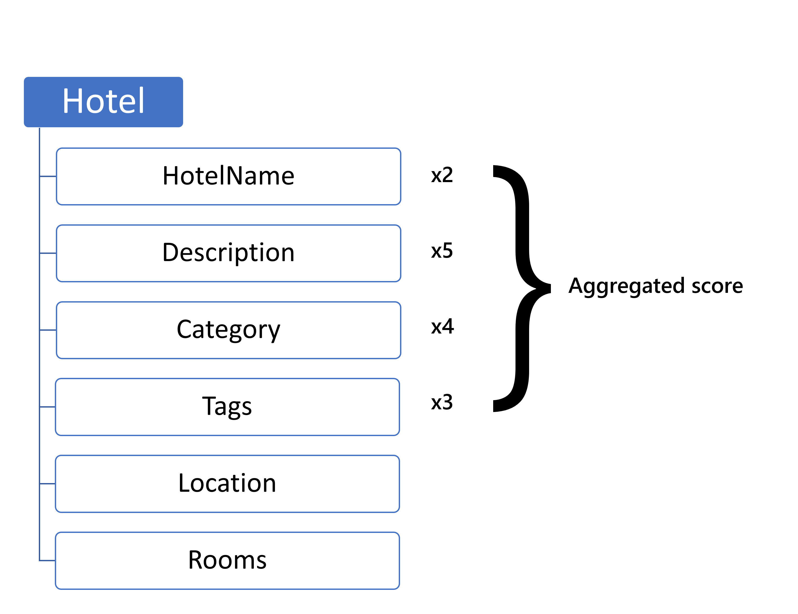

# 점수 매기기 프로필을 추가하여 결과의 관련성 향상


Azure AI 검색은 기본적으로 **BM25 유사성 순위 결정 알고리즘**을 사용하여, 검색어의 빈도, 희귀도 등을 기반으로 문서에 점수를 매깁니다. 이 기본 점수 방식으로는 항상 가장 관련성이 높은 문서를 최상위에 노출하지는 않기 때문에, **점수 매기기 프로필**을 통해 점수를 조정하는 방법이 필요합니다 ([Microsoft Learn][1]).

---

## 1. 검색 점수 계산 방식


* 검색 엔진은 쿼리 처리의 마지막 단계에서 이를 기반으로 **문서에 점수를 계산**합니다. 점수는:

  * 검색어 출현 빈도
  * 문서 크기
  * 용어의 희귀도
    등을 종합한 함수로 계산되며, 높은 점수를 받은 문서가 상위에 노출됩니다.
    동일한 점수의 문서가 있을 경우에는 `$orderby` 절을 통해 정렬 우선순위를 지정할 수 있습니다 ([Microsoft Learn][1]).

---

## 2. 문서의 점수 향상을 위한 프로필 활용

* BM25 기반 기본 점수는 모든 문서에 대해 동일하게 적용되어 원하는 결과가 항상 상위에 나타나지 않을 수 있습니다.
* **점수 매기기 프로필**을 사용하면, 특정 필드에 자동으로 **가중치를 적용하거나**, **함수 기반 조건**으로 점수를 자동 조정하게 할 수 있습니다 ([Microsoft Learn][1]).

---

## 3. 점수 매기기 프로필 구성 요소



### 3.1 텍스트 기반 가중치 (Weighted text fields)
특정 필드의 일치도에 따라 더 높은 점수를 주고 싶을 때 사용합니다.

```json
"text": {
  "weights": {
    "Description": 5,
    "Category": 2
  }
}
```

위 예시에서는 `Description` 필드가 `Category` 필드보다 2.5배 더 높은 가중치로 평가됩니다 ([Microsoft Learn][1]).

### 3.2 함수 기반 부스팅 (Functions)

단순 가중치로 조정하기 어려운 요소—예: 시간, 거리—에 사용합니다. 자주 쓰이는 함수 유형은 다음과 같습니다 ([Microsoft Learn][2]):

* **distance**
  지리적 좌표 기반 거리 계산을 통해 가까운 문서에 가중치를 높입니다.

* **freshness**
  `DateTime` 필드의 최신성에 따라 점수를 부여합니다.

* **magnitude**
  숫자 필드 값이 특정 범위 내에 있을 때 부스팅합니다.

* **tag**
  컬렉션(String tags) 내 항목이 쿼리와 일치할 경우 점수를 높입니다.

함수는 다음과 같은 방식으로 구성할 수 있습니다:

```json
"functions": [
  {
    "type": "distance",
    "boost": 5,
    "fieldName": "location",
    "interpolation": "logarithmic",
    "distance": {
      "referencePointParameter": "currentLocation",
      "boostingDistance": 10
    }
  }
]
```

위 예시에서는 현재 위치로부터 10km 이내인 문서에 대해 지수적(`logarithmic`) 부스팅을 제공합니다 ([Microsoft Learn][2]).

### 3.3 프로필 구조 예시

```json
"scoringProfiles": [
  {
    "name": "geo",
    "text": {
      "weights": {
        "hotelName": 5
      }
    },
    "functions": [
      {
        "type": "distance",
        "boost": 5,
        "fieldName": "location",
        "interpolation": "logarithmic",
        "distance": {
          "referencePointParameter": "currentLocation",
          "boostingDistance": 10
        }
      }
    ]
  }
]
```

위 예시는 `hotelName` 필드의 일치 여부와 **거리 기반 부스팅**을 조합한 구성입니다 ([Microsoft Learn][3]).

---

## 4. 점수 매기기 프로필 설정 및 사용

### 4.1 인덱스에 프로필 추가

Azure 포털 또는 REST API / SDK를 통해 인덱스 정의에 scoringProfiles 구성을 추가할 수 있습니다.

* 인덱스를 다시 생성할 필요 없이 **업데이트만으로 적용 가능**합니다 ([Microsoft Learn][3]).
* 인덱스당 **최대 100개의 프로필**까지 추가할 수 있으며, 쿼리 시에는 **한 번에 하나의 프로필만 지정 가능합니다** ([Microsoft Learn][2]).

### 4.2 REST API 예시

```http
POST /indexes/hotels/docs?api-version=2024-07-01
{
  "search": "inn",
  "scoringProfile": "geo",
  "scoringParameters": ["currentLocation--122.123,44.77233"]
}
```

이 예시는 `geo` 프로필을 지정하고, `currentLocation` 파라미터로 좌표를 전달하여 거리 기반 로직을 활성화합니다 ([Microsoft Learn][3]).

---

## 요약 테이블

| 항목                | 설명                                        |
| ----------------- | ----------------------------------------- |
| **기본 점수 방식**      | BM25 기반, 검색어 빈도/희귀도 중심                    |
| **가중치 부여 (text)** | 특정 필드에 높은 점수 적용                           |
| **함수 기반 부스팅**     | 최신성, 거리 등 복잡 조건 적용                        |
| **인덱스 업데이트 방식**   | 재색인 없이 포털/API/SDK 통해 적용                   |
| **프로필 최대 개수**     | 인덱스당 최대 100개                              |
| **사용 방식**         | 쿼리 시 scoringProfile과 scoringParameters 지정 |

---


[1]: https://learn.microsoft.com/ko-kr/training/modules/implement-advanced-search-features-azure-cognitive-search/03-improve-relevance-of-results-add-score-profiles "점수 매기기 프로필을 추가하여 결과의 관련성 향상 - Training | Microsoft Learn"
[2]: https://learn.microsoft.com/ko-kr/azure/search/index-add-scoring-profiles?utm_source=chatgpt.com "점수 매기기 프로필 추가 - Azure AI Search | Microsoft Learn"
[3]: https://learn.microsoft.com/en-us/azure/search/index-add-scoring-profiles?utm_source=chatgpt.com "Add scoring profiles - Azure AI Search | Microsoft Learn"
