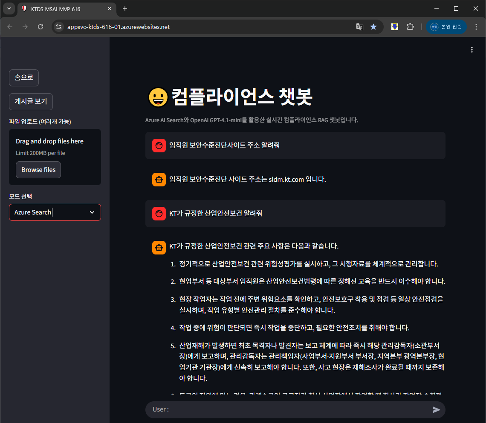
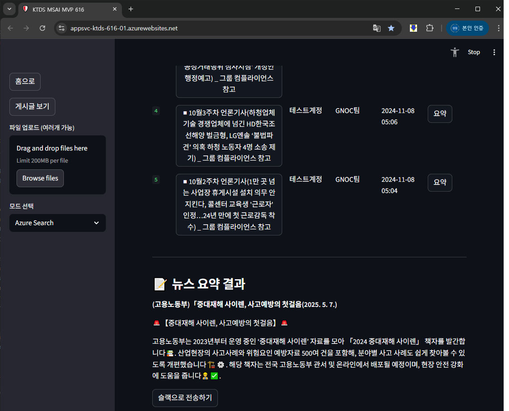
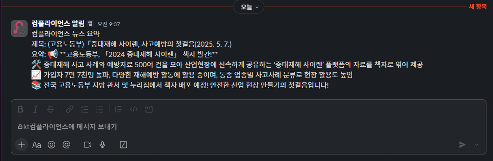
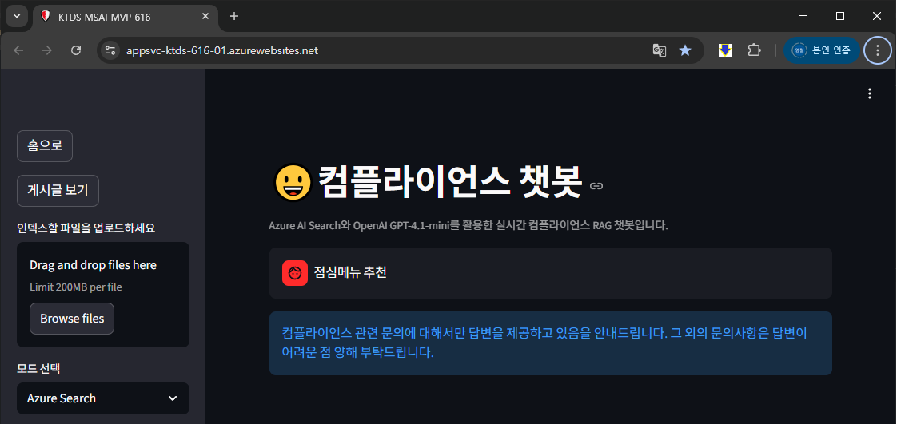
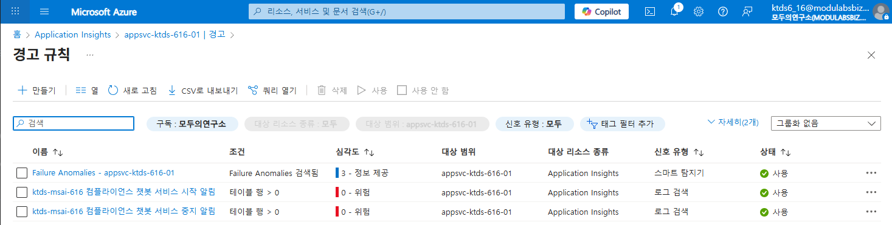
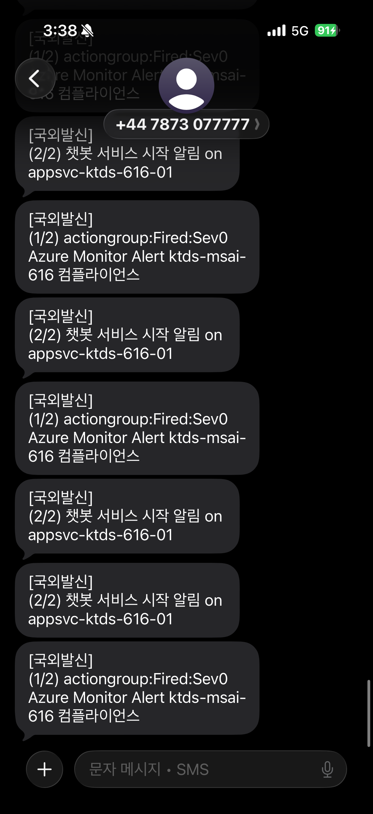

# 📘 컴플라이언스 AI어시스턴트 (RAG 기반)
✨ 이 문서는 로컬 개발 및 PoC(Proof of Concept) 배포를 위한 README입니다.

🎯 프로젝트 개요
---------------
RAG(Retrieval-Augmented Generation) 기반으로 KT내 컴플라이언스 관련 문서 및 최신 뉴스·사례를 검색·요약하여
직원 질문에 실시간으로 응답하고,  
요약 결과를 슬랙으로 자동 전송하는 AI 어시스턴트입니다.

> **컴플라이언스**: 기업 내 윤리적·법적·재무적 리스크를 사전에 방지하고 규정을 준수하도록 지원하는 활동

⚠️ 문제 정의
----------------------
1. 내부 규정이 방대하고 복잡하여 직원이 필요한 정보를 즉시 찾기 어려움
2. 컴플라이언스 관련 최신 동향 및 사례 인식 부족

   → 인식 제고 필요

✅ 해결 방안
-----------
1) RAG 기반 검색·응답
 - Azure AI Search로 관련 문서를 검색하고, 검색 결과를 컨텍스트로 Azure OpenAI(GPT-4.1-mini)에 전달하여
      정확하고 근거 있는 응답을 제공
<p align="left"></p>

2) 뉴스 요약 및 알림
 - 사내 게시글을 수집하여 요약을 생성하고, 결과를 슬랙으로 전송하여 인식 제고에 활용
<p align="left"></p>
<p align="left"></p>

## 🏗️ 시스템 아키텍처

```plaintext
사용자 질문
     ↓
[Streamlit Web UI]
     ↓
[LangChain]
     ↓
1. 질문 의도 분석 및 필터링
     ↓
2. RAG 파이프라인 처리
   - Azure AI Search: 관련 문서 검색
   - Azure OpenAI GPT-4.1 Mini: 답변 생성
     ↓
3. 응답 출력 (Q&A)

+ [뉴스 요약 및 슬랙 알림]
 - 게시판 크롤링
 - 뉴스 요약 처리 (GPT)
 - 슬랙 채널 자동 전송
 ```

🧰 주요 기술 스택 
----------------
- 프레임워크: LangChain
- 웹 UI: Streamlit
- 프로그래밍 언어: Python 3.11
- 클라우드: Microsoft Azure (AI Search, OpenAI, App Service, Blob Storage, Application Insights)
- 통신/알림: Slack (Incoming Webhooks)

💬 RAG 검색 시나리오 예시 
-----------------------
- "임직원 보안수준진단사이트 주소 알려줘" → 관련 문서 내 링크/참고 제공
- "KT가 규정한 산업안전보건 알려줘" → 사내 규정을 정리
- "점심메뉴 추천" → 업무 범위를 벗어난 요청은 거부 및 가이드 안내
<p align="left"></p>

```
📁 프로젝트 실제 파일 구조
---------------------------------------------
ktds-msai-6th-mvp/
├─ .deployment                      # 배포 관련(옵션)
├─ .env                             # 환경변수 (로컬/비공개)
├─ app.py                           # Streamlit 앱 엔트리포인트
├─ README.md                        # 프로젝트 설명서
├─ streamlit.sh                     # App Service용 시작/설치 스크립트
├─ __pycache__/                      # 파이썬 캐시 (배포/로컬)
├─ assets/
│   ├─ mvp1.png                      # 다이어그램 이미지
│   ├─ mvp2.png                      # 다이어그램 이미지
│   ├─ mvp3.png                      # 다이어그램 이미지
│   ├─ mvp4.png                      # 다이어그램 이미지
│   └─ mvp5.png                      # 다이어그램 이미지
├─ data/
│   ├─ 9_field.json                  # 카테고리 샘플
│   ├─ appinsights_events.log        # (로컬/배포) 폴백 이벤트 로그
│   ├─ board_data.json               # 게시글 예시 데이터
│   ├─ 컴플라이언스 9대분야.xlsx
│   └─ uploads/
│       └─ 9_field.json              # 업로드된 샘플
├─ modules/
│   ├─ appinsight.py                 # Application Insights 초기화/로그
│   ├─ azure_ai_search.py            # Azure Search 유틸/클라이언트
│   ├─ newssummary.py                # 게시판/요약/Slack 전송 로직
│   ├─ test_appinsights_local.py     # 로컬 전송 테스트 스크립트
│   └─ __pycache__/                  # 모듈 캐시
└─ .gitignore                       # (선택) 배포/로컬 비공개 파일 제외 권장
```

## 📈 Azure 모니터링
Application Insights를 통해 애플리케이션 상태(시작/종료)를 수집하도록 구성

1) 구성 요약
- 코드 위치: `modules/appinsight.py` (Application Insights 초기화 함수 `init_appinsights` 포함)
- 앱 시작/종료 이벤트: `app.py`에서 `app_start`(앱 시작 시)와 `app_stop`(종료 시)를 전송합니다.
- 필요 환경변수: `APPLICATIONINSIGHTS_CONNECTION_STRING` (App Service의 Application settings 또는 로컬 `.env`에 설정)
- 배포 시 의무: 배포 환경(예: App Service)에 opencensus 관련 패키지들이 설치되어 있어야 로그 전송이 가능(`streamlit.sh` 를 확인)

2) 동작 원리(간단)
- 앱이 시작될 때 `app_start` 이벤트가 track_event로 전송
- 프로세스가 SIGTERM 또는 SIGINT를 받으면 `app_stop` 이벤트를 전송
- Application Insights는 전송된 로그/트레이스/이벤트를 수집하고 Azure Portal의 Logs(또는 Live Metrics)에서 확인

3) Kusto(Logs) 예제 쿼리
- `app_stop`만 필터링하여 최근 이벤트를 확인할 때:

```kusto
traces
| where timestamp > ago(2d)
| where message contains "app_stop" or message contains "[EVENT] app_stop" 
| summarize count() by cloud_RoleName
```

4) Azure Monitor에서 경고(Alert) 만들기 (app_stop 감지)
<p align="left"></p>
<p align="left"></p>

## 🚀 향후 개선사항
- 멀티모달 RAG 도입(텍스트, 이미지, 오디오 등 여러 종류의 데이터를 통합적으로 처리하고 검색하는 RAG 기술)
- LangChain 체이닝으로 응답을 단계별로 생성·검증·개선해 정확도 향상 
- LangGraph와 LangSmith로 체인 흐름과 실행 트레이스를 모니터링하여 품질을 보증


URL : <a href="https://appsvc-ktds-616-01.azurewebsites.net/" target="_blank" rel="noopener noreferrer">https://appsvc-ktds-616-01.azurewebsites.net/</a>